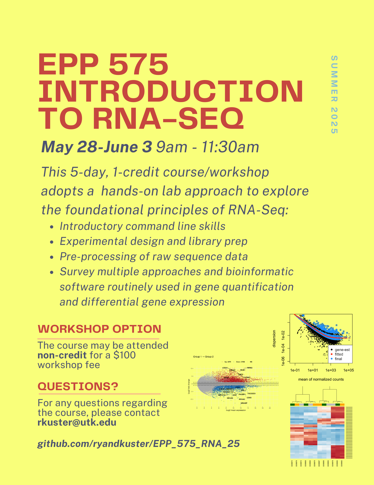

# EPP 575 Introduction to RNA-Seq

EPP 575 Introduction to RNA-Seq is being offered as a 5 day, 1 credit-hour course (CRN 87151) *or* a non-credit workshop for $100.

For course content, please see the [wiki](https://github.com/ryandkuster/EPP_575_RNA_25/wiki).

---

Course details:

>Computational analysis of RNASeq data. Students will learn the basics of using a command line interface on UT’s Linux-based computational resources to analyze RNASeq data. Basic steps such as quality assessment, read mapping and differential gene expression statistical analysis will be covered. Contact Hour Distribution: One-week summer workshop. Topics include designing, sequencing, and analyzing RNA Seq experiments with bioinformatics approaches. This class will meet for one week, WRF/MT May 28-30 and June 2-3 from 9:00 - 11:30 each day in ANR 124

---

The workshop cost is $100 per attendee.

Interested? Contact rkuster@utk.edu.

*This workshop is contingent on enrollment, so please don't hesitate to request a spot!*

